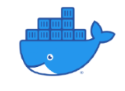

## DevOps-Project ##
--------------------

### Project-Name: Docker CI/CD pipeline build and workflow ###
--------------------------------------------------------------

| Author  |  *Oluwaremilekun Osisanya* |
|:-------:| :---------:|
| **Project** |  *Docker hosted CI/CD infrastructure* |
| **Version** |  *v1.0* | 

---------------------------------------------------------------

- [X] Project to locally host a full fledge CI/CD infrastructure on docker.
- [x] You can start the services by following the [commands](./commands.md) file of the application
- [x] For configuration you can contact me <remi.osisanya@outlook.com> if you cannot complete the setup.
- [x] You can start docker on you machine using the `docker-script.ps1` file typing `pwsh docker-script.ps1 ` on your cli.

